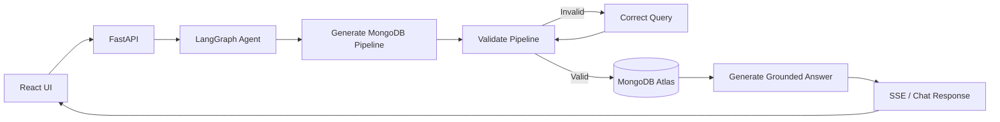
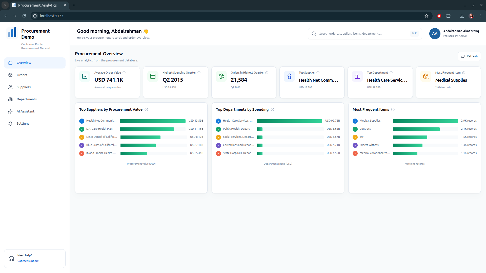
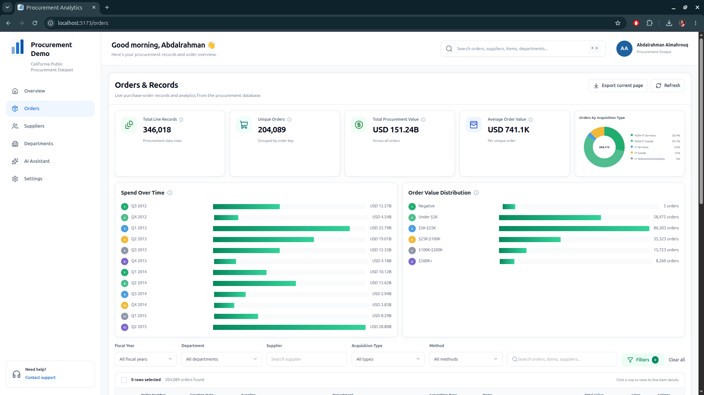
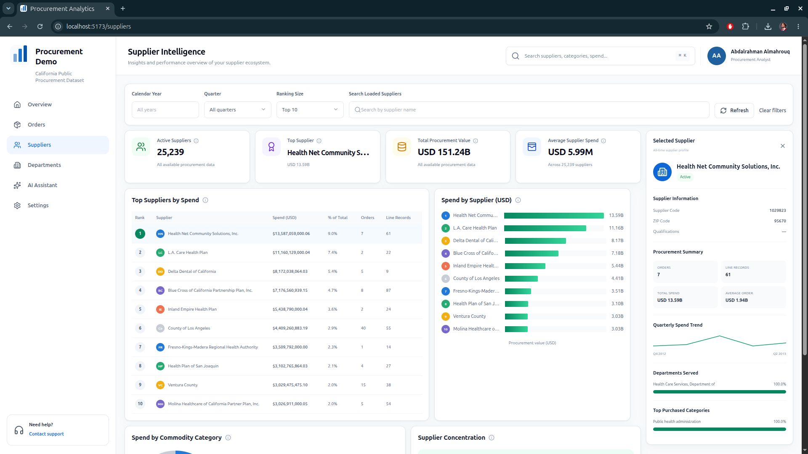
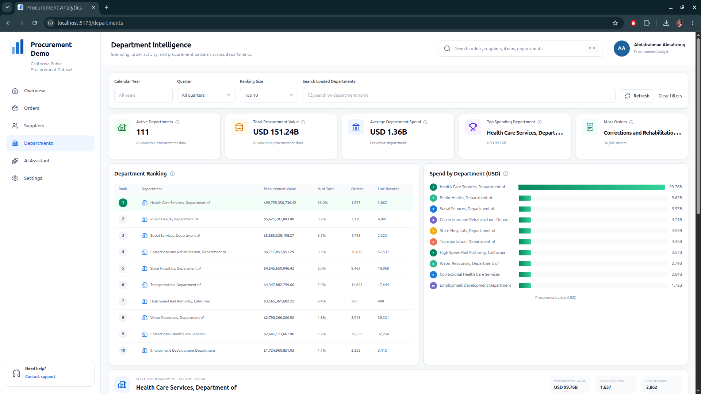
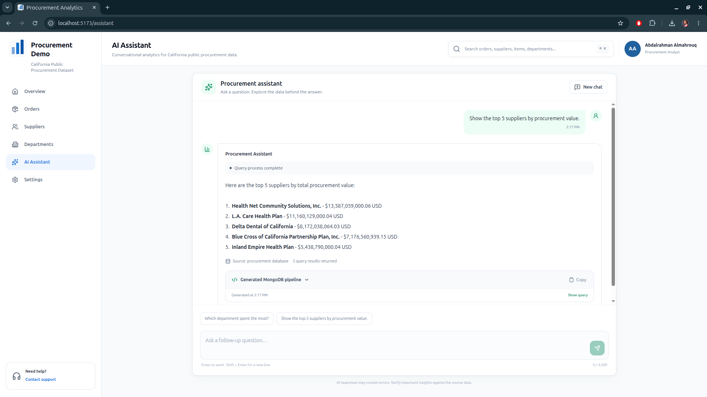

# Procurement Analytics & AI Assistant

A full-stack procurement analytics application built on the **California public procurement dataset**. The project combines a React analytics dashboard with a FastAPI/MongoDB backend and a conversational AI assistant that translates natural-language procurement questions into validated MongoDB aggregation pipelines.

The main goal of the project is to demonstrate how traditional procurement analytics and an agentic AI workflow can work together over the same source data.

---

## Highlights

- Interactive analytics for **orders, suppliers, and departments**
- MongoDB Atlas as the analytical data store
- FastAPI backend with reusable aggregation endpoints
- React + TypeScript + Tailwind CSS frontend
- Natural-language → MongoDB query generation
- LangGraph workflow with validation and automatic query correction
- Grounded answers generated from real MongoDB results
- Follow-up conversation support with thread-based memory
- Server-Sent Events (SSE) for live workflow progress and streamed answers
- Generated MongoDB pipeline available in the UI for transparency

---

## Tech Stack

| Layer | Technology |
| --- | --- |
| Frontend | React, TypeScript, Tailwind CSS |
| Backend | FastAPI, Python |
| Database | MongoDB Atlas |
| AI orchestration | LangChain, LangGraph |
| LLM provider | OpenRouter |
| Model | `xiaomi/mimo-v2.5` |
| Streaming | Server-Sent Events (SSE) |
| Data processing | Pandas |

---

## Project Architecture



The analytics pages and the AI assistant use the same `procurement_records` collection, so both traditional dashboards and conversational answers are grounded in the same dataset.

### Important data semantics

- One MongoDB document represents a **procurement line record**
- A reconstructed unique purchase order is identified by `order_key`
- Procurement value is calculated from `total_price`
- Order counts use distinct `order_key` values
- `creation_date` is the primary time field used for analysis
- Helper fields such as `year`, `month`, and `quarter` support efficient time-based queries

---

## Application Pages

### Overview

The Overview page provides a high-level snapshot of procurement activity. It combines key procurement metrics and summary visualizations to help users quickly understand overall purchasing activity.



### Orders

The Orders page focuses on **what is being purchased**. It includes order-level KPIs, spending trends, acquisition-type analysis, order-value distribution, filtering, pagination, and detailed order exploration.



### Suppliers

The Suppliers page focuses on **who the organization is buying from**. It includes supplier activity, top suppliers by procurement value, average supplier spend, supplier rankings, and spend by procurement category.



### Departments

The Departments page focuses on **which departments are spending the money**. It includes department rankings, procurement value, spending trends, top suppliers, category analysis, and acquisition-type breakdowns.



### AI Assistant

The AI Assistant allows users to ask procurement questions conversationally instead of manually selecting filters or building reports.

Examples:

- `How many orders were placed in Q2 2014?`
- `Which quarter had the highest procurement spending?`
- `Who were the top 5 suppliers by procurement value in 2014?`
- `Which department spent the most on IT Goods in Q3 2013?`
- Follow-up: `What about IT Services?`

The assistant dynamically generates a MongoDB aggregation pipeline, validates it before execution, queries MongoDB Atlas, and then produces a concise answer grounded in the returned data.

The workflow also supports automatic query correction when validation fails, conversation context for follow-up questions, and SSE streaming so the frontend can display progress and answer text as the workflow runs. Private reasoning and internal graph state are not streamed to the client.



---

## AI Assistant Workflow

At a high level, each user question follows this process:

1. The LLM receives the procurement schema, business rules, and current conversation context.
2. It generates a structured MongoDB aggregation pipeline.
3. A deterministic Python validator checks the pipeline before any database execution.
4. Invalid pipelines are sent through a correction/retry path.
5. Valid pipelines execute against MongoDB Atlas with result and execution safeguards.
6. The returned data is passed to the answer-generation step.
7. The final answer is streamed back to the frontend.
8. Conversation state is preserved by thread ID so follow-up questions can reuse context.

The validator is intentionally separate from the LLM. It restricts unsupported or unsafe MongoDB behavior and prevents generated queries from being executed blindly.

---

## Selected API Endpoints

The backend contains additional analytics routes; these are some of the most important ones.

| Method | Endpoint | Purpose |
| --- | --- | --- |
| `GET` | `/api/orders/summary` | Order KPIs and procurement summary |
| `GET` | `/api/orders` | Paginated and filterable order explorer |
| `GET` | `/api/suppliers/ranking` | Top suppliers by procurement value |
| `GET` | `/api/departments/summary` | Department-level procurement KPIs |
| `POST` | `/api/chat` | Standard AI assistant request |
| `POST` | `/api/chat/stream` | Streaming AI workflow using SSE |

FastAPI also exposes interactive API documentation at:

```text
http://127.0.0.1:8000/```

---

## Repository Structure

```text
.
├── backend/
│   └── app/
│       ├── ai/
│       │   ├── agent/
│       │   ├── nodes/
│       │   ├── prompts/
│       │   ├── schema/
│       │   └── validators/
│       ├── database/
│       ├── queries/
│       ├── routers/
│       └── services/
├── frontend/
├── data/
│   ├── raw/
│   └── processed/
├── notebooks/
├── scripts/
└── 
    └── screenshots/
```

---

## Local Setup

### 1. Clone the repository

```bash
git clone <YOUR_REPOSITORY_URL>
cd penny-procurement-assessment
```

### 2. Create the Conda environment

```bash
conda create -n procurement-ai-assistant python=3.11
conda activate procurement-ai-assistant
```

### 3. Install backend dependencies

From the backend directory:

```bash
cd backend
pip install -r requirements.txt
```

If your dependency file is maintained at the repository root, run the equivalent command from that location instead.

The backend relies on packages such as FastAPI, Uvicorn, PyMongo, Pandas, LangChain, LangGraph, `langchain-openai`, Pydantic, `python-dotenv`, and `dnspython`.

### 4. Configure environment variables

Create a `.env` file in the location used by the backend configuration.

```env
MONGODB_URI=mongodb+srv://<username>:<password>@<cluster-url>/
MONGODB_DB=penny_procurement

OPENROUTER_API_KEY=<your-openrouter-api-key>
OPENROUTER_MODEL=xiaomi/mimo-v2.5
OPENROUTER_BASE_URL=https://openrouter.ai/api/v1
```

Never commit `.env` to source control.

### 5. Prepare MongoDB Atlas

1. Create a MongoDB Atlas cluster.
2. Create a database user.
3. Allow your development IP address under Network Access.
4. Add the Atlas connection string to `MONGODB_URI`.
5. Ensure the application uses the `procurement_records` collection.

### 6. Prepare and load the procurement data

Place the source CSV in the project's raw data directory:
- and here is the link of the data : 
- https://www.kaggle.com/datasets/sohier/large-purchases-by-the-state-of-ca
- put the downloaded data into data/raw directory 


Run the repository's cleaning/preprocessing script to create the processed dataset, then import it into MongoDB Atlas using the ingestion script.

Typical workflow:

```bash
python scripts/clean_data.py
python scripts/import_to_mongodb.py
```

The preprocessing stage normalizes column names, converts dates and numeric values, creates `order_key`, and derives helper time fields such as `year`, `month`, and `quarter`.

If your Atlas collection has already been populated, this step can be skipped.

### 7. Run the backend

From `backend/`:

```bash
uvicorn app.main:app --reload
```

Backend:

```text
http://127.0.0.1:8000
```

Swagger documentation:

```text
http://127.0.0.1:8000/```

### 8. Run the frontend

In a second terminal:

```bash
cd frontend
npm install
npm run dev
```

The Vite development server normally runs at:

```text
http://localhost:5173
```

The frontend is intentionally lightweight relative to the backend/AI implementation: it consumes the analytics APIs, renders dashboard views, manages the conversation ID, and displays streamed AI responses and generated MongoDB pipelines.

---

## AI Verification

The AI workflow was tested incrementally before frontend integration, including:

- structured MongoDB query generation
- procurement-specific query semantics
- safety validation
- invalid-query correction and retry
- execution against the real Atlas collection
- grounded answer generation
- follow-up conversation understanding
- thread isolation and memory
- FastAPI chat requests
- SSE streaming, keep-alives, error handling, and client disconnect cleanup

The generated queries can also be compared against the manually implemented analytics endpoints to verify that both approaches return consistent procurement results.

---

## Dataset

This project uses the **Large Purchases by the State of California** public procurement dataset. The source contains purchase-order and line-level procurement information including departments, suppliers, acquisition types, items, prices, quantities, and UNSPSC classification data.

---

## Notes

- The application uses USD because the source data represents California public procurement.
- Conversation memory currently depends on the configured LangGraph checkpointer. If an in-memory checkpointer is used, conversations are reset when the backend process restarts.
- AI-generated answers should remain grounded in database results. The generated MongoDB pipeline is exposed in the UI to make the analytical process easier to inspect.

---

